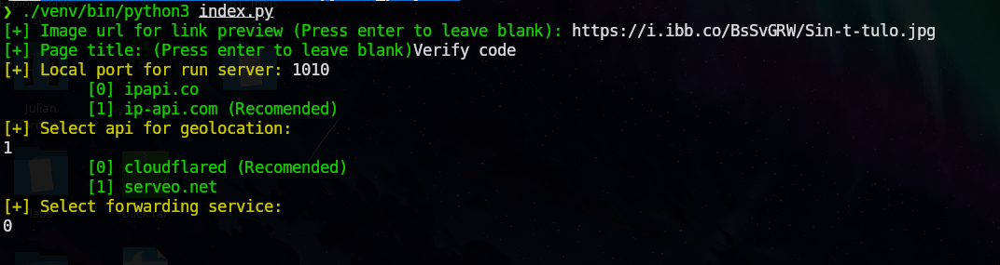
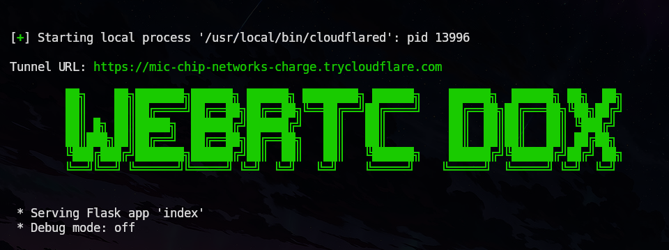
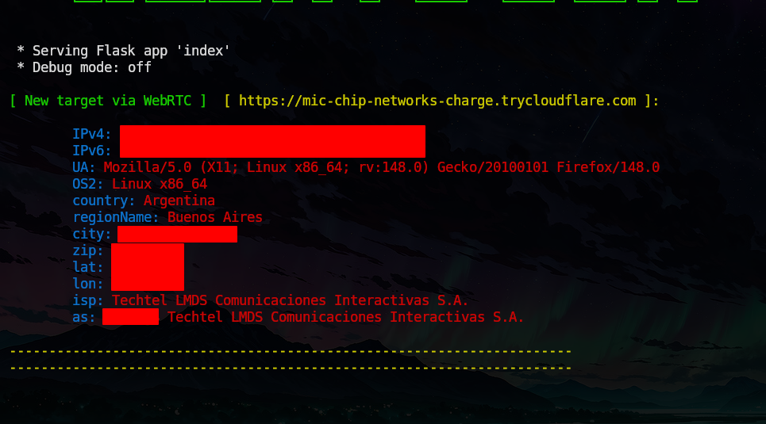
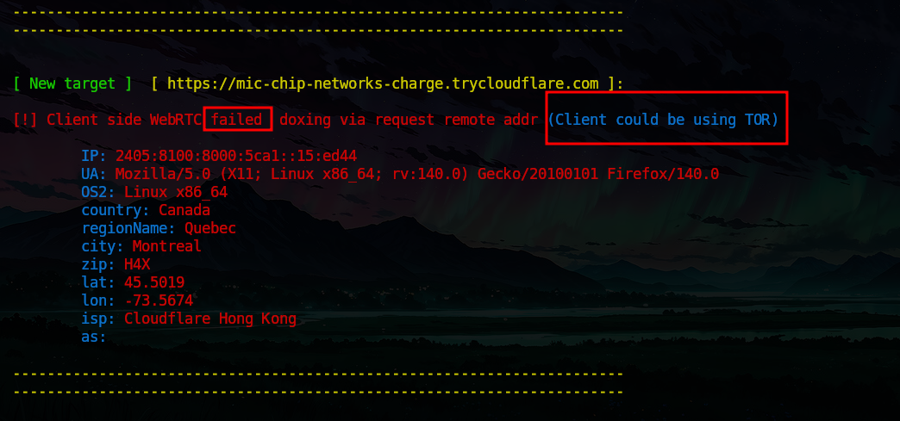
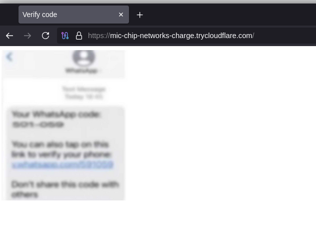

> WebRTC-Dox is a flask API proyect for testing WebRTC Doxing capabilities


## Features
- Web image preview customization via url
- Web title customization
- Cloudflared & serveo.net integration for tunneling
- WebRTC IP discovering via stun servers
- Api integration for geolocation
- Failover in case of WebRTC fail in client side 


## Installation
```bash
git clone https://github.com/SebSecRepos/WebRTC-Dox.git
cd WebRTC-Dox
python3 -m venv venv 
source venv/bin/activate
pip3 install -r requirements.txt
```

## Usage
```bash
venv/bin/python3 ./index.py 
```





